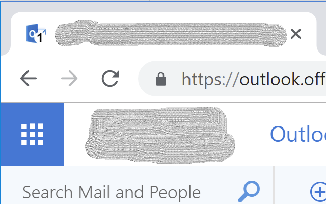

# unread-count-for-outlook
A Chrome plugin to display Outlook unread messages count on the tab

This plugin will work for the following url patterns:
- https://\*/owa/*
- https://\*.outlook.com/*
- https://outlook.live.com/*
- https://\*.office.com/*
- https://\*/mail/inbox\*

